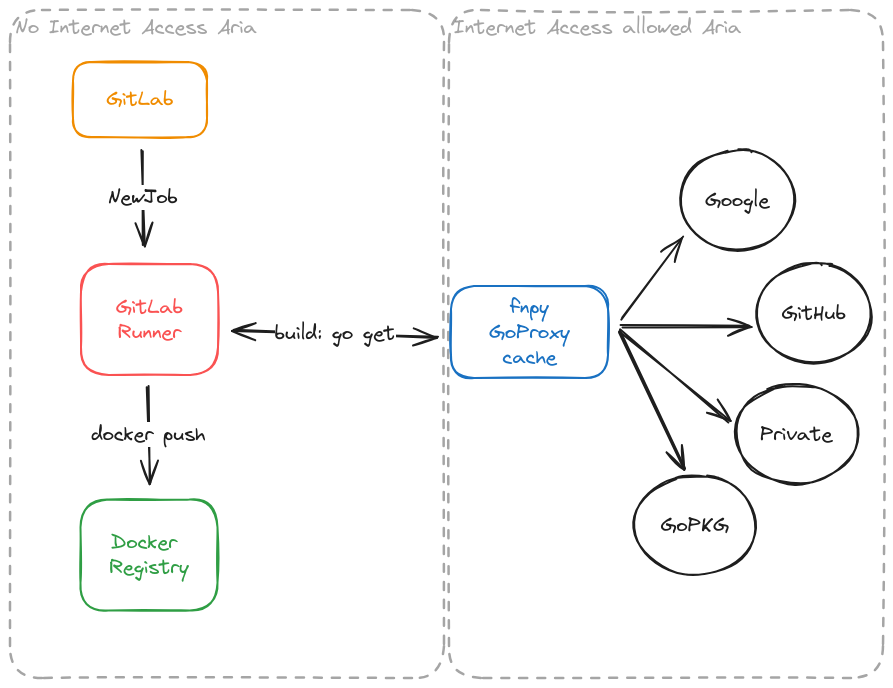

# goproxy

<p align="center">
    
</p>

## Description
This repository contains a Docker Compose file for setting up a GoProxy service using [Athens](https://github.com/gomods/athens) and Nginx as a reverse proxy.
This repo is inspired by [Why you should use a go module proxy](https://arslan.io/2019/08/02/why-you-should-use-a-go-module-proxy/)

## Prerequisites
Docker and Docker Compose should be installed on your system.

## Installation and Setup
```
docker compose up -d
```

## my latest result

```
=> [build 4/5] RUN go mod download    2179.7s
```

second time (I have removed caches `docker builder prune`):

```
=> [build 4/5] RUN go mod download    213.2s
```
